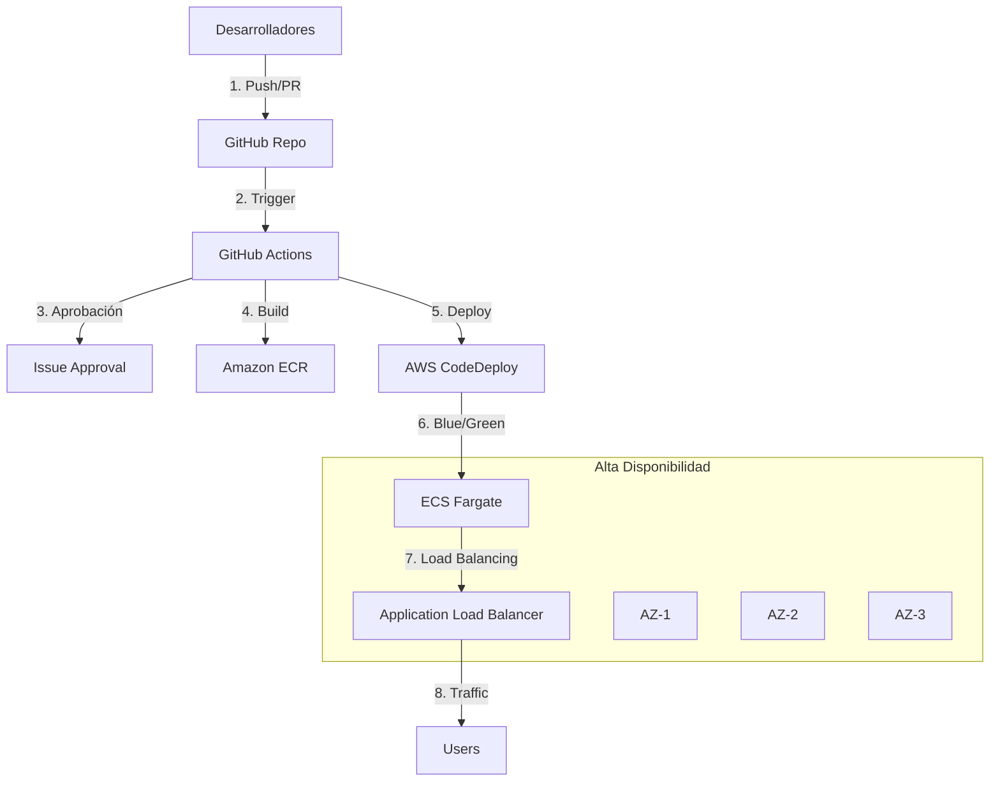

# Proyecto de Despliegue Continuo con AWS Fargate

Este proyecto implementa un pipeline de despliegue continuo para una aplicación Nginx utilizando AWS Fargate, con una estrategia Blue/Green deployment y alta disponibilidad.

## Arquitectura



## Estructura del Proyecto

```plaintext
.
├── .github
│   └── workflows
│       ├── prod.yml
│       └── uat.yml
├── infrastructure
│   └── main.tf
├── Dockerfile
├── task-definition.json
└── index.html
```

## Componentes Principales

### 1. VPC y Networking:
- VPC dedicada con CIDR 10.0.0.0/16
- 3 subredes públicas en diferentes AZs
- Internet Gateway y Route Tables configuradas

### 2. Contenerización:
- Imagen Nginx personalizada
- Repositorio ECR para almacenamiento de imágenes

### 3. Orquestación de Contenedores:
- ECS Fargate para ejecución sin servidor
- Despliegue Blue/Green para actualizaciones sin downtime

### 4. Balanceo de Carga:
- Application Load Balancer (ALB)
- Health checks configurados
- Target Groups para Blue/Green deployment

## Flujo de Despliegue

1. Los desarrolladores crean un Pull Request
2. Se requiere aprobación mediante comentario en el issue
3. Al aprobar, se construye y publica la imagen Docker
4. Se realiza el despliegue Blue/Green
5. Se verifica la salud del nuevo despliegue
6. Se redirige el tráfico al nuevo despliegue
7. Se limpia la versión anterior

## Entornos

- **UAT**: Activado por PR a `develop`
- **Producción**: Activado por PR a `master`

## Requisitos de Configuración

### Secrets de GitHub Necesarios:
- `AWS_PROD_ACCESS_KEY_ID`
- `AWS_PROD_SECRET_ACCESS_KEY`
- `AWS_ACCOUNT_ID`
- `PUBLIC_SUBNET_IDS`
- `SECURITY_GROUP_ID`
- `GREEN_TARGET_GROUP_ARN`
- `GREEN_LISTENER_RULE_ARN`
- `ALB_DNS`
- `ECR_REPOSITORY_NAME`
- `ECS_CLUSTER_NAME`
- `CONTAINER_NAME`
- `SERVICE_PREFIX`
